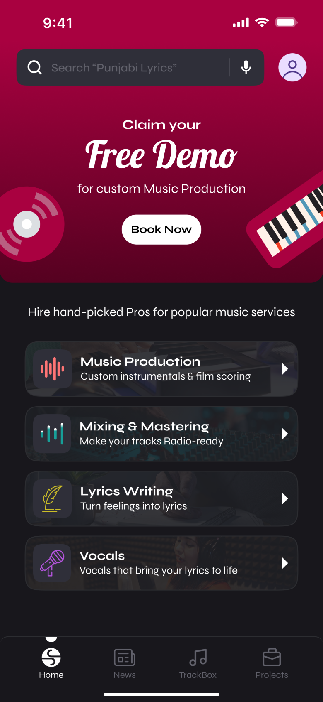
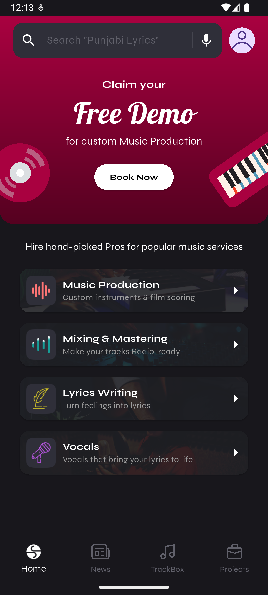
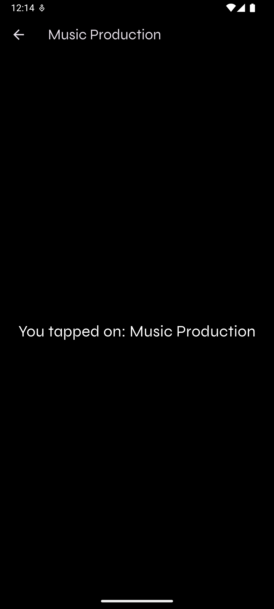

# S.Rocks.Music

This Flutter app connects users with professional music services, offering features like music production, mixing, mastering, lyrics writing, and vocals. The app integrates Firebase for backend services and uses the Provider package for state management.

## Preview

https://github.com/user-attachments/assets/9f6b0939-a049-4993-b8bb-13cff8b553ea

<table>
  <tr>
    <td>Orignal Image</td>
  </tr>
  <tr>
    <td></td>
  </tr>
  <tr>
    <td>Screen 1</td>
    <td>Screen 2</td>
  </tr>
  <tr>
    <td></td>
    <td></td>
  </tr>
</table>

## Folder Structure

-   **`lib/`**: Main source code directory.

    -   **`views/`**: Contains UI screens.
        -   `home_screen.dart`: The main screen with a search bar, banner, and services list.
        -   `service_detail_screen.dart`: SVG icons used in the UI.
    -   **`views/widgets/`**: Reusable UI components.
        -   `banner_section.dart`: Displays a promotional banner with a gradient background and icons.
        -   `custom_search_bar.dart`: A custom search bar with a profile avatar.
        -   `service_card.dart`: A card widget for displaying individual services.
        -   `custom_bottom_navigation_bar.dart`: A custom bottom navigation bar.
    -   **`viewmodels/`**: Contains state management logic.
        -   `service_viewmodel.dart`: Manages the state of services (e.g., loading, errors, data).
    -   `main.dart`: Entry point of the app, initializes Firebase and sets up the app with Provider.

-   **`assets/`**: Static assets.
    -   **`banners/`**: PNG images used in the Service Button for background.
    -   **`fonts/`**: Fonts used in the UI.
    -   **`icons/`**: SVG and PNG icons used in the UI.

## Approach

-   **State Management**: Used the Provider package to manage the state of services (`ServiceViewModel`) and update the UI reactively.
-   **UI Design**:
    -   The `HomeScreen` features a dark theme with a gradient banner section at the top.
    -   The banner section (`BannerSection`) includes a "Claim your Free Demo" message and a "Book Now" button, with CD and piano icons positioned to the left and right of the button, extending slightly off-screen for a dynamic look.
    -   The `CustomSearchBar` is overlaid on the gradient background, followed by a list of services displayed in a `ListView`.
-   **Firebase Integration**: Initialized in `main.dart` to support backend services (e.g., fetching service data).
-   **Assets**: SVG icons are used for visual elements, ensuring scalability and quality.

This structure ensures modularity, reusability, and a clean separation of concerns between UI, state management, and assets.

## Technologies Used

-   Flutter
-   Dart
-   Firebase
-   Android Studio

## Features

-   Firebase Integration
-   Responsive and clean layout
-   MVVM architecture
-   Provider for state management
-   Dependency Injection

## Contributing

I welcome contributions from the community! If you'd like to contribute to the app, please fork the repository, create a branch, and submit a pull request with your changes. Make sure to follow the code style and commit message conventions outlined in the repository.

## Contact

If you have any questions, suggestions, or feedback, please feel free to contact me at shenmareparas@gmail.com or create an issue in the repository. I'd love to hear from you!

## Enjoy the App!
